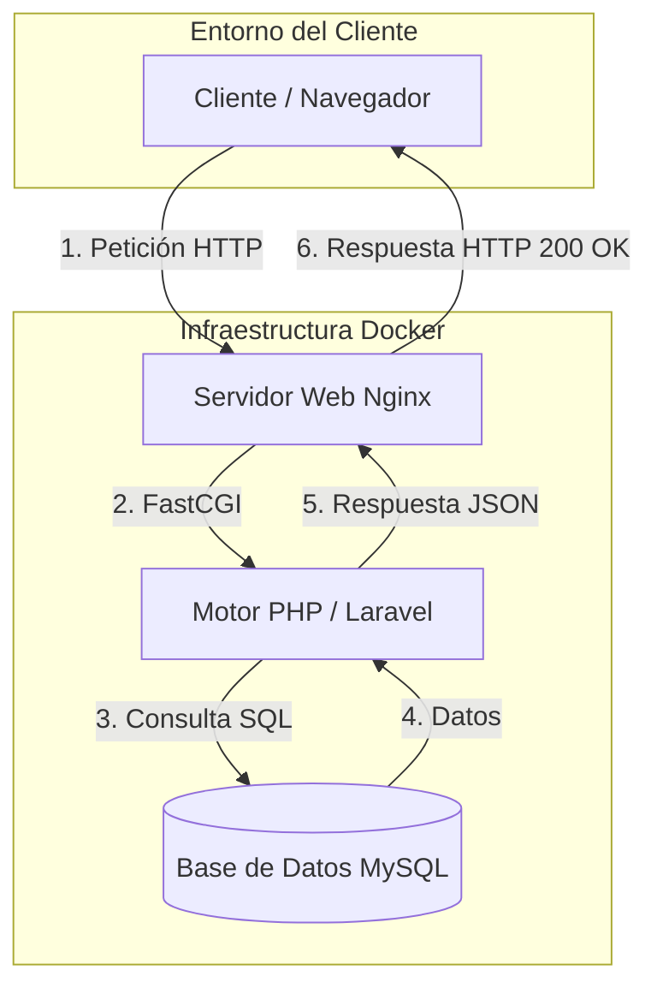

# pruebamermaid

```mermaid
graph TD
    subgraph "Entorno del Cliente"
        A[Cliente / Navegador]
    end

    subgraph "Infraestructura Docker"
        B[Servidor Web Nginx]
        C[Motor PHP / Laravel]
        D[(Base de Datos MySQL)]
    end

    A -->|1. Petición HTTP| B
    B -->|2. FastCGI| C
    C -->|3. Consulta SQL| D
    D -->|4. Datos| C
    C -->|5. Respuesta JSON| B
    B -->|6. Respuesta HTTP 200 OK| A
```
